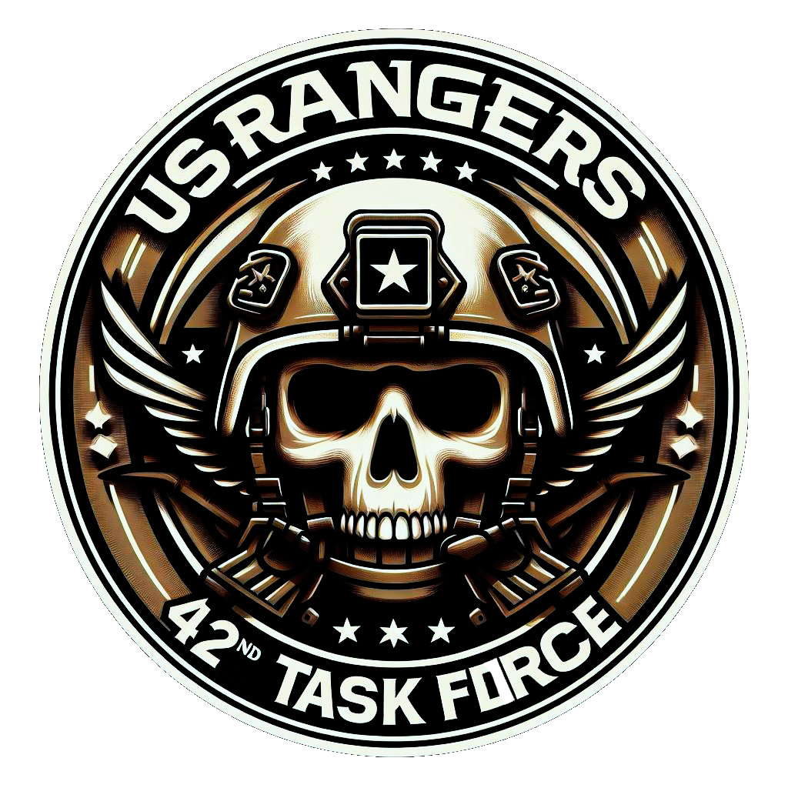

<p align="center">
    
</p>

<h1 align="center">GitHub</h1>
<p align="center">
    <a href="https://github.com/MultiTheFranky/rtf-42nd/releases/latest">
        
    </a>
    <a href="https://github.com/MultiTheFranky/rtf-42nd/issues">
        
    </a>
    <a href="https://github.com/MultiTheFranky/rtf-42nd/pulls">
        
    </a>
    <a href="https://github.com/MultiTheFranky/rtf-42nd/actions/workflows/main.yml">
        
    </a>
    
</p>

<h1 align="center">Steam</h1>
<p align="center">
    <a href="https://steamcommunity.com/sharedfiles/filedetails/?id=3129705630">
        
    </a>
    <a href="https://steamcommunity.com/sharedfiles/filedetails/?id=3129705630">
        
    </a>
    <a href="https://steamcommunity.com/sharedfiles/filedetails/?id=3129705630">
        
    </a>
    <a href="https://steamcommunity.com/sharedfiles/filedetails/?id=3129705630">
        
    </a>
    <a href="https://steamcommunity.com/sharedfiles/filedetails/?id=3129705630">
        
    </a>
    <a href="https://steamcommunity.com/sharedfiles/filedetails/?id=3129705630">
        
    </a>
    <a href="https://steamcommunity.com/sharedfiles/filedetails/?id=3129705630">
        
    </a>
</p>


<p align="center">
    <sup><strong>Requires the latest version of <a href="https://github.com/CBATeam/CBA_A3/releases">CBA A3</a> and <a href="https://github.com/acemod/ACE3/releases">ACE3</a>.<br/></strong></sup>
</p>

# 42nd RTF for Arma 3

## Requirements

-   Git (https://git-scm.com/downloads)
-   HEMTT (https://github.com/BrettMayson/HEMTT)

### Extensions
-   Rust (https://rustup.rs)
-   Cross (https://github.com/cross-rs/cross) - You can install using `cargo install cross --git https://github.com/cross-rs/cross`
-   Docker (https://docker.com) - You can install it using the script dockerInstall.ps1
-   Cmake (https://cmake.org) - To compile the rust playmusic extension

## Setup

1. Clone the repository

```bash
 git clone https://github.com/MultiTheFranky/rtf-42nd.git rtf42
```

2. Open the folder

```bash
 cd rtf42
```

## Development

```bash
 .\updateHemtt.bat
 .\debug.bat
```

Execute every time you whan to recompile functions

```sqf
[] call ACE_PREP_RECOMPILE;
```

every time that you want to recompile the functions.
Or you can setup a keybind on custom action 20 on Arma 3.

# License

License under CUP License - https://www.cup-arma3.org/cup-license

# Credits

- arma-rs - https://github.com/BrettMayson/arma-rs Thanks for develop the rust extension adapter.
- ACE3 - https://github.com/acemod/ACE3 Thanks for the develop of ACE3 and the development wiki.
- CBA_A3 - https://github.com/CBATeam/CBA_A3 Thanks for the macros and the develop structure of Arma 3 Mods.
- HEMTT - https://github.com/BrettMayson/HEMTT Thanks for the Arma 3 mod builder.
- Arma 3 - https://arma3.com/ Thanks for the base game and the DLCs.
